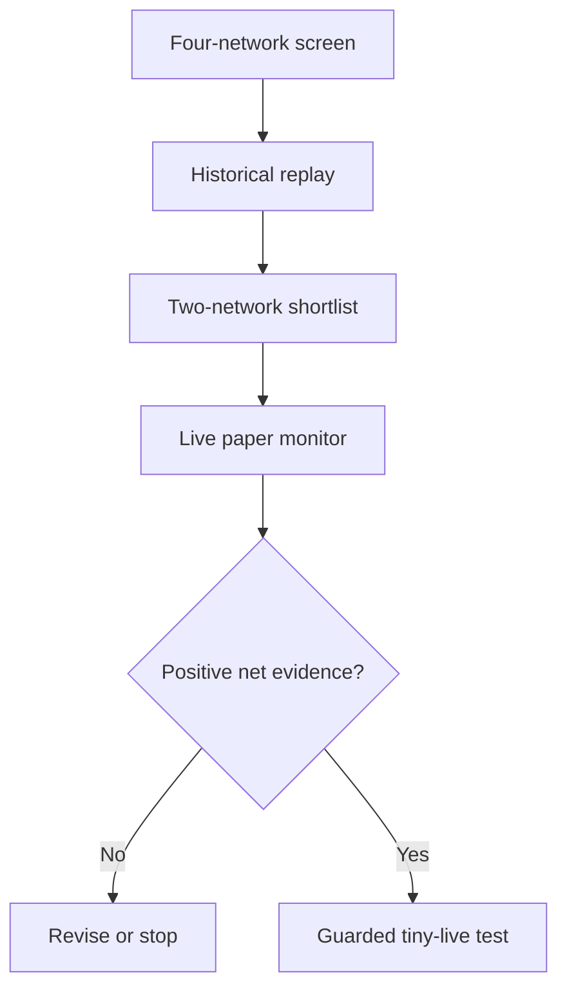

# Multi-Chain DEX & MEV Arbitrage Lab

Research-first, multi-chain workspace for studying reproducible DEX arbitrage and adjacent MEV strategies on **Solana, Base, Robinhood Chain, and Ethereum**.

> Status: research and paper-trading only. No production executor is implemented, no profit is claimed, and no private keys belong in this repository.

## Why this repository exists

The project started from a forensic reconstruction of a Solana transaction that converted a very small USDC input into roughly 696k USDC through an atomic three-hop route after a severe liquidity dislocation. That event is useful as a test fixture, but it is not treated as a repeatable income forecast.

The broader goal is to answer a narrower and more useful question:

> Which network and strategy offers a reproducible edge that survives realistic latency, execution costs, failed attempts, infrastructure expenses, and competition?

## Research tracks

| Network | Initial focus | Expected edge |
| --- | --- | --- |
| Solana | cyclic AMM/DLMM arbitrage, backruns, liquidity dislocations | low latency, accurate state reconstruction, Jito auction strategy |
| Base | AMM cycles, backruns, on-chain probing | sequencer-aware state and efficient EVM simulation |
| Robinhood Chain | AMM ↔ RFQ/propAMM/orderbook, stock-token dislocations | fragmented price formation plus latency |
| Ethereum | private-orderflow backruns, liquidations, multi-protocol and CEX–DEX research | strategy design, orderflow, execution contracts |

## Start here

If you are a person:

1. Read [`AGENTS.md`](AGENTS.md) for the canonical reading order.
2. Read [`docs/project-context.md`](docs/project-context.md) for the origin and current hypotheses.
3. Read [`docs/research-methodology.md`](docs/research-methodology.md) before interpreting any profit figure.
4. Open the relevant network document under [`docs/networks/`](docs/networks/).
5. Review [`docs/roadmap.md`](docs/roadmap.md) and [`docs/decision-log.md`](docs/decision-log.md).

If you are using ChatGPT or another coding/research agent, copy the repository URL into a new conversation and use [`prompts/00-project-onboarding.md`](prompts/00-project-onboarding.md).

## Latest research sprint

The 2026-09-25 multi-agent network screen is complete. It recommends Base and Robinhood Chain for the next bounded data-collection phase, keeps Ethereum as a narrow MEV-Share side experiment, and gates broader Solana work on raw historical reconstruction.

- [Sprint recommendation](research/2026-09-25/recommendation.md)
- [Cross-network scorecard](research/2026-09-25/cross-network-scorecard.md)
- [Independent review](research/2026-09-25/independent-review.md)
- [Stage-2 preregistration](research/2026-09-25/preregistration.md)

## Repository map

```text
.
├── AGENTS.md                    # canonical AI onboarding and working rules
├── docs/
│   ├── project-context.md       # origin, ANB case and current hypotheses
│   ├── research-methodology.md  # evidence and go/no-go method
│   ├── architecture.md          # target research platform architecture
│   ├── roadmap.md               # phased execution plan
│   ├── decision-log.md          # decisions and assumptions
│   ├── evidence-template.md     # standard research evidence record
│   └── networks/                # network-specific research
├── prompts/                     # reusable prompts for new AI sessions
├── schemas/                     # machine-readable data contracts
├── src/arb_lab/                 # dependency-light research utilities
├── data/samples/                # synthetic/non-secret examples only
└── tests/                       # contract and smoke tests
```

## Research funnel



The LLM is used for hypothesis formation, code generation, review, and interpretation. Deterministic scripts should perform bulk chain-data collection and calculations so results remain reproducible and token-efficient.

## Quick start

Requires Python 3.11+.

```bash
python -m pip install -e .
python -m unittest discover -s tests -v
python -m arb_lab.cli validate data/samples/opportunities.jsonl
python -m arb_lab.cli summarize data/samples/opportunities.jsonl
```

The current code is deliberately small. It validates the shared opportunity record and produces basic aggregate metrics; network collectors and execution adapters are roadmap items.

## Research rules

- Separate confirmed facts, derived calculations, hypotheses, and recommendations.
- Store transaction hashes, block/slot, timestamps, source URLs, and calculation version.
- Report gross and net PnL separately.
- Include failed attempts and infrastructure cost.
- Evaluate recurring income and rare tail events separately.
- Never infer profitability from DEX volume alone.
- Never commit a seed phrase, private key, RPC key, bearer token, or wallet export.

## Contributing

See [`CONTRIBUTING.md`](CONTRIBUTING.md). Network research should be submitted with reproducible queries or scripts and an evidence record.

## Disclaimer

This repository is for engineering and market-structure research. It is not financial advice and does not guarantee that a strategy is profitable or safe. Blockchain transactions are irreversible and experimental execution can lose the entire allocated capital.

## License

MIT — see [`LICENSE`](LICENSE).
