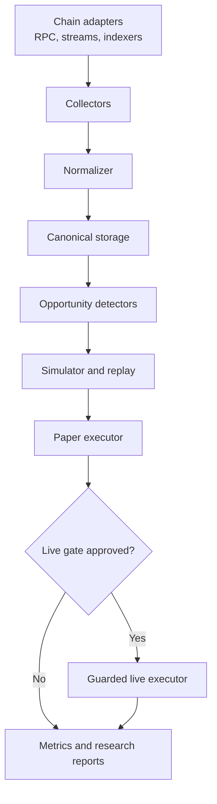

# Architecture

## Purpose

This repository is a **research-first, multi-chain arbitrage laboratory**. Its first job is to produce reproducible evidence about where opportunities exist, how long they survive, what execution costs they incur, and whether a modest implementation can compete. Live trading is a later, deliberately gated capability.

The design keeps chain-specific mechanics behind adapters while sharing the data model, analytics, simulation, controls, and reporting. Initial research targets are Solana, Base, Robinhood Chain, and Ethereum; the architecture should not assume that any one of them will become the first production target.

## System flow



Every layer writes enough provenance to reproduce its output. A detector result without its source block, pool state, quote assumptions, fee model, and code version is not considered valid research evidence.

## Pipeline responsibilities

### 1. Chain adapters

Adapters isolate network differences and expose common capabilities rather than pretending all chains work alike.

Suggested interfaces:

- `BlockSource`: canonical block/slot identifiers, timestamps, finality and reorg notifications.
- `StateSource`: pool, order book, oracle, lending and token state at a known block reference.
- `TransactionSource`: decoded successful and failed transactions, receipts, logs and balance changes.
- `QuoteAdapter`: deterministic quote for a venue at an explicit state reference.
- `SimulationAdapter`: read-only transaction or bundle simulation.
- `SubmissionAdapter`: disabled by default; sends an approved transaction through an explicitly configured path.
- `CostModel`: gas/base fee, priority fee, tips, rent, protocol fees and expected failed-attempt cost.

An adapter declares its capabilities. For example, Solana may support slot-based streaming and bundle submission, while an EVM rollup may expose a sequencer feed and transaction receipts. Core logic must not silently fall back when a capability is unavailable.

### 2. Collectors

Collectors ingest bounded historical ranges or live streams. They should:

- checkpoint progress and resume idempotently;
- persist raw responses or content-addressed references where licensing and size allow;
- record provider, endpoint class, request time, receive time and chain timestamp;
- distinguish finalized, provisional and reorganized observations;
- implement rate limits, retries with jitter and gap detection;
- never contain trading keys.

Collectors do not decide whether an event is arbitrage.

### 3. Normalizer

The normalizer converts heterogeneous chain records into versioned canonical events. It resolves token decimals, maps venues and pools to stable identifiers, derives explicit asset deltas, and preserves raw references for audit.

Normalization must be deterministic. Given the same raw input and schema version, it should produce byte-equivalent canonical output.

### 4. Storage

Use storage by workload:

- immutable compressed files (for example Parquet) for raw and normalized historical datasets;
- PostgreSQL for metadata, experiments, opportunity records and execution journals;
- an optional analytical engine only after query volume justifies it;
- object storage for large replay fixtures and reports.

Do not make a hosted database mandatory for local research. Small checked-in fixtures must be synthetic, public, or redacted and must carry provenance.

### 5. Opportunity detectors

Detectors consume canonical state and emit **candidates**, not trades. Candidate families may include:

- two-venue and triangular cyclic arbitrage;
- AMM/RFQ/order-book divergence;
- oracle or cross-session dislocations;
- liquidation and multi-protocol paths;
- event-driven or protocol-specific anomalies.

Each detector is pure where practical: explicit input state, explicit assumptions, deterministic candidate output. Network I/O belongs outside detector logic.

### 6. Simulator and historical replay

The simulator is the main research instrument. It reconstructs venue state at a block or slot, re-quotes every leg, models price impact and fees, and evaluates the full route atomically where supported.

Required outputs include:

- gross proceeds and net profit in native units and a documented USD conversion;
- protocol fees, network fees, priority fees/tips and failure cost assumptions;
- required capital and temporary inventory exposure;
- sensitivity to trade size and execution delay;
- rejection reason when a candidate is not executable;
- confidence/quality flags for incomplete state or uncertain pricing.

Replay should evaluate a delay curve (for example 0, 50, 100, 250, 500 and 1,000 ms, where meaningful) rather than assuming zero-latency execution.

### 7. Paper executor

The paper executor observes live opportunities and follows the real decision path without signing or submitting a transaction. It records:

- detection, quote, simulation and hypothetical submission timestamps;
- the exact route and size that would have been submitted;
- expected versus subsequently observed outcome;
- why an opportunity expired or failed policy checks;
- provider latency and data staleness.

Paper results must be labeled hypothetical. They are not equivalent to fills and should not be presented as realized PnL.

### 8. Guarded live executor

Live execution is a separate package and deployment boundary. It consumes only fully specified execution intents that pass policy checks. It does not discover routes.

The live path requires:

- explicit build-time and runtime enablement;
- wallet, chain, venue, token and contract allowlists;
- preflight simulation at a recent state reference;
- minimum net-profit and maximum-slippage checks;
- per-trade, per-hour and per-day exposure/spend limits;
- nonce/blockhash freshness checks;
- circuit breakers and an operator kill switch;
- append-only decision and submission audit logs.

See [security.md](security.md) for the threat model and controls.

## Canonical data contracts

Schemas should live in `/schemas`, be versioned, and reject unknown breaking changes in CI. At minimum, define the following records.

### `MarketEvent`

```text
schema_version, event_id, network, chain_id, block_height_or_slot,
block_hash, tx_hash, event_index, chain_time, observed_at,
finality, venue, pool_or_market, event_type, assets, raw_ref
```

### `PoolState`

```text
schema_version, network, venue, pool_id, state_ref, assets,
reserves_or_liquidity, fee_parameters, tick_or_bin_state,
oracle_refs, captured_at, source_ref
```

### `OpportunityCandidate`

```text
schema_version, opportunity_id, detector_version, network, state_ref,
route, input_asset, input_amount, expected_output, gross_profit,
estimated_costs, expected_net_profit, assumptions, detected_at,
expires_at_or_after, source_refs
```

### `SimulationResult`

```text
schema_version, simulation_id, opportunity_id, simulator_version,
state_ref, delay_scenario_ms, trade_size, success, output_amount,
cost_breakdown, net_profit, rejection_reason, trace_ref, simulated_at
```

### `ExecutionRecord`

```text
schema_version, execution_id, mode, opportunity_id, policy_version,
decision, decision_reasons, signed_tx_hash_or_null, submitted_at_or_null,
landed_state_ref_or_null, realized_asset_deltas, realized_costs,
realized_net_profit, status, error_class
```

Numeric asset values must use integers in base units plus explicit decimals. Never use binary floating point for balances, quotes, or PnL. USD values must name the pricing source and timestamp.

## Suggested monorepo layout

```text
.
├── docs/                    # Research method, architecture, security, decisions
│   └── networks/            # Network-specific findings and assumptions
├── schemas/                 # Versioned canonical contracts
├── src/
│   ├── adapters/            # solana, base, robinhood, ethereum
│   ├── collectors/          # historical and live ingestion
│   ├── normalizer/          # canonical event/state conversion
│   ├── storage/             # repositories and migrations
│   ├── detectors/           # strategy candidates; no submission logic
│   ├── simulator/           # quote, replay, delay and cost models
│   ├── paper_executor/      # live observation without signing
│   ├── live_executor/       # isolated, deny-by-default execution boundary
│   ├── policy/              # limits, allowlists and circuit breakers
│   ├── observability/       # metrics, traces, structured logs
│   └── cli/                 # reproducible research commands
├── data/samples/            # Small safe fixtures only
├── tests/                   # Unit, property, integration and replay tests
├── prompts/                 # Context and research prompts for collaborators
└── .github/                 # CI, templates and security automation
```

The implementation language may differ by component. Prefer the smallest stack that keeps calculations deterministic. A latency-sensitive executor can later be implemented in Rust without forcing all research notebooks or ETL into the same language.

## Observability and auditability

Use structured logs with stable event names and correlation IDs spanning candidate → simulation → policy decision → execution. Do not log secrets, signed raw transactions before expiry, or sensitive provider credentials.

Core metrics:

- collector lag, gaps, reconnects and reorg depth;
- normalization failures and unknown protocol versions;
- candidates by detector, venue and profit bucket;
- simulation success rate and rejection reasons;
- end-to-end latency histograms by pipeline stage;
- paper expected PnL versus outcome at measured delays;
- live submission, landing and revert/failure rates;
- fees, tips, realized asset deltas and net PnL;
- exposure and budget utilization;
- circuit-breaker state and policy denials.

Every experiment should record the git commit, schema versions, configuration hash, input dataset identifiers and wall-clock interval. This makes findings portable to another researcher or ChatGPT conversation without relying on hidden context.

## Delivery phases and gates

1. **Research foundation:** schemas, collectors, normalized samples and reproducible notebooks/reports.
2. **Historical replay:** reproduce known transactions and calculate net economics under stated assumptions.
3. **Live paper monitoring:** measure opportunity frequency, lifespan, latency and winner concentration for 7–14 days.
4. **Candidate selection:** choose one network and strategy using documented evidence, not maximum observed jackpot.
5. **Guarded tiny-live test:** independently reviewed code, dedicated wallet, minimal capital and hard loss limits.
6. **Scale decision:** increase coverage or speed only when measurements show which bottleneck limits realized profit.

No phase should be skipped merely because a historical transaction was unusually profitable.
