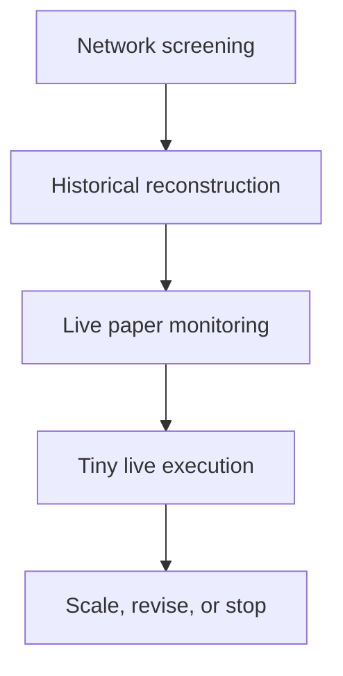

# Research Methodology

## Purpose

This document defines the shared, reproducible method for evaluating DEX and MEV opportunities across Solana and EVM-compatible networks. The goal is not to prove that arbitrage exists. It is to determine whether a narrowly defined strategy can be detected, simulated, and executed by this project after all observable costs and realistic latency.

The process is deliberately staged. Expensive data, infrastructure, engineering, and live capital are introduced only after the preceding stage passes explicit gates.

## Research principles

1. **One hypothesis at a time.** A study unit is a specific network, venue set, strategy class, asset universe, and observation window.
2. **Code collects; models interpret.** Deterministic scripts fetch, decode, normalize, and aggregate transactions. LLMs receive compact tables, exceptions, and representative samples rather than raw block histories.
3. **Net PnL is the decision metric.** Volume, gross spread, transaction count, and isolated jackpots are supporting evidence only.
4. **Observed and estimated values are separate.** On-chain transfers and paid fees must not be mixed silently with reconstructed quotes, USD conversions, or hypothetical latency costs.
5. **Negative results are retained.** Failed transactions, reverted bundles, stale quotes, and losing attempts are required to estimate the true economics.
6. **Every result is reproducible.** Findings identify the source, block range, collection time, code revision, decoder version, assumptions, and exclusions.
7. **No live execution before paper validation.** Live trading begins only with a capped wallet, explicit loss limits, and an emergency stop.

## The research funnel

Each stage produces a fixed output package and a go/hold/stop decision. A network or strategy that fails a gate may be revisited when market structure or infrastructure changes, but it does not consume downstream resources in the current cycle.

## Stage 1: network and strategy screening

### Objective

Rank candidate network/strategy pairs cheaply before downloading large histories or writing execution code.

### Scope

For each candidate, document:

- settlement and transaction-ordering model;
- relevant AMMs, order books, RFQ systems, lending venues, or oracle feeds;
- atomic execution and simulation capabilities;
- public, private, sequencer, validator, or relay data paths;
- visible competition and known searcher infrastructure;
- estimated cost of RPC, streaming data, archival queries, server placement, and transaction delivery;
- feasibility of identifying successful and unsuccessful attempts on-chain;
- smallest credible prototype and its dependencies.

### Evidence budget

Use official protocol and network documentation first. Add primary on-chain observations and reputable research only where they answer a defined question. Avoid broad web searches once the evidence needed for the scorecard is sufficient.

### Output

- one scorecard row per network/strategy pair;
- a source register;
- assumptions and unknowns;
- a shortlist of no more than two candidates for historical reconstruction.

### Gate

Proceed only if all of the following are true:

- the opportunity can be represented and evaluated from accessible data;
- a historical replay is technically possible;
- the initial data and compute budget is acceptable;
- there is a plausible entry path without exclusive order flow or validator ownership;
- the hypothesis is specific enough to falsify.

## Stage 2: historical reconstruction

### Objective

Determine how often the strategy occurred, who captured it, what it paid after observable costs, and whether our simulator reproduces representative transactions.

### Sampling plan

Do not start with an unbounded chain scan. Use a declared, deterministic sample:

1. **Baseline windows:** at least 14 complete ordinary UTC days, selected before viewing profitability results.
2. **Stress windows:** 2–3 complete days containing elevated volume, volatility, liquidation activity, depegs, launches, or another predeclared trigger.
3. **Event cases:** known transactions used for decoder and PnL validation. These must not be used alone to estimate opportunity frequency.
4. **Searcher sample:** the 20–30 most active or profitable candidate actors found in the selected windows, plus a reproducible random sample when the population is larger.
5. **Transaction sample:** target 100–300 classified opportunities per candidate where available. If fewer exist, report the full population and the shortfall.

Record the exact block/slot boundaries, selection query, timezone, inclusion rules, exclusions, and missing-data periods. If sampling changes after results are viewed, create a new version and explain why.

### Classification

Each candidate transaction receives:

- a strategy class, such as cyclic arbitrage, cross-venue arbitrage, backrun, liquidation, oracle/venue divergence, RFQ/AMM, or unknown;
- a confidence level for that classification;
- normalized legs and venues;
- observed and estimated financial fields;
- competitor and failure context when observable.

Ambiguous transactions remain `unknown`; do not force classification to improve apparent coverage.

### Financial reconstruction

Use a common unit, normally USD, while retaining native-asset amounts and pricing provenance.

`gross_pnl` is the value of final assets minus initial assets before execution costs. It must include all legs and inventory changes attributable to the opportunity.

`execution_cost` includes, when applicable:

- base transaction fees and gas;
- priority fees;
- validator, builder, relay, or Jito tips;
- protocol and flash-loan fees not already reflected in swap outputs;
- failed or reverted attempt costs attributable to the strategy;
- explicit hedging or settlement costs, if measured.

`net_pnl = gross_pnl - execution_cost`

Infrastructure subscriptions and engineering costs are reported separately as period costs. The project should calculate both:

- **trade net PnL:** after variable execution costs;
- **fully loaded PnL:** trade net PnL minus allocated infrastructure costs.

Do not infer profit from a single token balance delta without reconciling wrapped assets, token decimals, internal transfers, flash loans, inventory carried across transactions, and the valuation timestamp.

### Latency-decay analysis

Historical best-case profit is not executable profit. Reprice or replay the same candidate after standard delays from the observed trigger:

- 0 ms;
- 50 ms;
- 100 ms;
- 250 ms;
- 500 ms;
- 1,000 ms;
- one additional chain-specific block or slot interval when useful.

For each delay, report:

- opportunities still profitable;
- median and total net PnL;
- success probability under the simulation assumptions;
- share of original profit remaining;
- reasons for decay: state change, ordering loss, slippage, liquidity removal, gas/tip competition, or data unavailability.

If sub-block state cannot be reconstructed, mark the corresponding estimates as model-dependent rather than fabricating millisecond precision.

### Competition and winner concentration

Calculate net-profit concentration by attributed searcher or entity:

- top-1, top-3, and top-10 profit share;
- Herfindahl-Hirschman Index (HHI), when attribution coverage is adequate;
- repeat-win rate;
- number of distinct competitors per opportunity;
- share of opportunities won by unidentified actors.

Wallet clustering must be presented as an inference with the clustering rules documented. An address is not automatically an independent operator.

### Failure costs

Include transactions or bundles that paid fees but failed to realize the intended route. Report:

- number and rate of failures;
- total and median failure cost;
- failure cost per successful trade;
- causes where observable;
- whether failures are visible on-chain or omitted by the delivery mechanism.

Unknown off-chain rejected submissions are an explicit blind spot, not zero cost.

### Recurring returns versus tail events

Analyze two distributions separately:

1. **Recurring economics:** median day, median trade, trimmed mean, active-day ratio, daily PnL excluding the largest 1% of trades, and longest loss/no-profit streak.
2. **Tail economics:** P95/P99 trade PnL, maximum trade, share of total PnL from the largest 1/5/10 trades, and event conditions.

Never annualize a jackpot from one event. Report results both with and without the largest event and state the observation period.

### Gate

Proceed to live paper monitoring only if:

- multiple transactions are reproduced to within a documented tolerance;
- positive results are not solely an accounting artifact or a single unrepeatable event;
- variable costs and visible failures are included;
- at least some opportunities remain positive at a plausible end-to-end delay;
- the required live data path is available within the test budget;
- open uncertainties are measurable during paper monitoring.

## Stage 3: live paper monitoring

### Objective

Measure opportunity frequency, lifetime, detection delay, quote decay, and hypothetical execution without signing or broadcasting trades.

Run continuously for 7–14 days initially, spanning weekdays and a weekend. Extend the window when the strategy is explicitly tail-driven; absence of a jackpot is not by itself a failure, but absence of detectable recurring events may be.

For every signal, persist:

- source event and detection timestamps;
- state version, block, or slot;
- candidate route and optimized input size;
- gross and net estimate;
- assumed fee/tip bid;
- simulation result at decision time;
- subsequent realized state at the configured delay checkpoints;
- rejection reason when no paper order is admitted.

Measure the end-to-end pipeline, not just RPC ping: source publication → receipt → decode → route calculation → simulation → signed-ready payload.

### Gate

Proceed to tiny live execution only if:

- the monitor is stable and recovers from disconnects without silent gaps;
- accounting reconciles sampled signals independently;
- positive paper PnL survives realistic delay and cost assumptions;
- the expected test value justifies capped live failure costs;
- alerting, spend limits, key isolation, and a kill switch are tested.

## Stage 4: tiny live execution

### Objective

Test whether paper opportunities can actually be landed and settled profitably.

Use a dedicated wallet and explicit limits:

- maximum capital at risk;
- maximum input per transaction;
- maximum daily variable cost and loss;
- minimum expected net profit and safety margin;
- maximum consecutive failures;
- approved contracts, programs, tokens, and venues;
- automatic halt on stale data, reconciliation mismatch, abnormal slippage, or infrastructure degradation.

Start with the smallest size that produces meaningful execution evidence. Treat early trades as measurement, not revenue.

### Gate

Scale only when landed transactions reconcile, aggregate live trade net PnL is positive after failures, observed latency matches the model, and performance persists across enough independent opportunities to exclude one-off luck. Otherwise revise the model, narrow the strategy, or stop.

## Core metrics

Every study reports at least:

- opportunities and profitable opportunities per day;
- attempted, landed, reverted, expired, and rejected counts;
- gross PnL, variable execution cost, trade net PnL, and fully loaded PnL;
- median, P90, P95, P99, maximum, and total trade net PnL;
- capital turnover and net PnL divided by peak capital at risk;
- opportunity lifetime and latency-decay curve;
- winner concentration;
- failure cost per success;
- recurring-versus-tail decomposition;
- data coverage and classification coverage.

Include counts and observation duration beside percentages. Small samples must not be presented with false precision.

## Data provenance and reproducibility

Every dataset and report must include a manifest containing:

- network and chain ID;
- source provider, endpoint class, and API/version when known;
- exact block/slot range and UTC time range;
- collection timestamp;
- raw-data hash or immutable object reference;
- repository commit hash;
- collector, decoder, pricing, and simulator versions;
- configuration hash;
- token metadata source and decimal handling;
- price source, quote currency, and valuation timestamp policy;
- known gaps, retries, provider errors, exclusions, and manual corrections;
- license or redistribution constraints.

Secrets, private endpoints, wallet keys, and personally identifying provider account data must never be committed. Public reports should contain enough identifiers to independently refetch public chain data.

## Confidence levels

Assign confidence per material finding, not only once per report:

- **High:** directly observed on-chain or reproduced independently; complete relevant cost accounting; stable across multiple samples or sources.
- **Medium:** supported by primary documentation and partial reconstruction, but one material input is estimated or coverage is incomplete.
- **Low:** plausible inference, small or biased sample, unresolved entity attribution, unavailable state, or reliance on secondary claims.

State what evidence would raise confidence. Never convert missing evidence into a zero value.

## Stop, hold, and go decisions

Each stage ends with exactly one decision:

- **Go:** all mandatory gates pass; proceed with a capped budget and named next experiment.
- **Hold:** evidence is incomplete but a bounded experiment can resolve it; state cost, owner, and deadline.
- **Stop:** economics, access, reproducibility, or risk fails a mandatory gate; archive evidence and define what market change would justify reopening.

Decisions must distinguish facts, model outputs, assumptions, and recommendations.

## LLM-efficient workflow

To minimize model usage while retaining auditability:

1. Fetch each block range once and cache raw responses outside the model context.
2. Decode and normalize deterministically into the shared opportunity schema.
3. Generate machine summaries: coverage, distributions, top exceptions, and representative samples.
4. Give the LLM the research question, methodology version, manifest, aggregate tables, and a small stratified sample.
5. Request a structured finding with evidence references, confidence, contradictions, and next test.
6. Store accepted findings in versioned Markdown/JSON so subsequent agents read conclusions and provenance instead of repeating searches.
7. Reopen raw records only for anomalies, audit samples, or disputed calculations.

Recommended context bundle per analytical run:

- one question;
- one methodology/version reference;
- one dataset manifest;
- one aggregate metrics file;
- no more than 20–30 representative opportunity records unless the task specifically requires more;
- a short list of unresolved anomalies.

## Required research output format

Every network or strategy report uses this structure:

1. **Question and falsifiable hypothesis**
2. **Scope and sample** — network, venues, assets, blocks/slots, dates, inclusion/exclusion rules
3. **Data provenance** — manifest and coverage limitations
4. **Method** — decoder, PnL formula, pricing, latency model, entity attribution
5. **Results** — core metrics with sample sizes
6. **Recurring economics**
7. **Tail-event economics**
8. **Competition and failure costs**
9. **Sensitivity analysis** — latency, fees/tips, size, price source
10. **Contradictory or missing evidence**
11. **Findings by confidence level**
12. **Decision: Go, Hold, or Stop**
13. **Next bounded experiment** — expected cost, duration, success criterion
14. **Artifacts** — queries, code revision, datasets, hashes, and source links

## Integrity checks before publication

- Recompute totals from normalized records.
- Reconcile a stratified sample against a block explorer or independent provider.
- Confirm token decimals and signs of every PnL component.
- Verify that failed-attempt costs are not omitted or double-counted.
- Compare results with and without outliers.
- Confirm no future information leaked into historical route selection or pricing.
- Validate every normalized record against `schemas/opportunity.schema.json`.
- Record unresolved discrepancies rather than forcing reconciliation.
